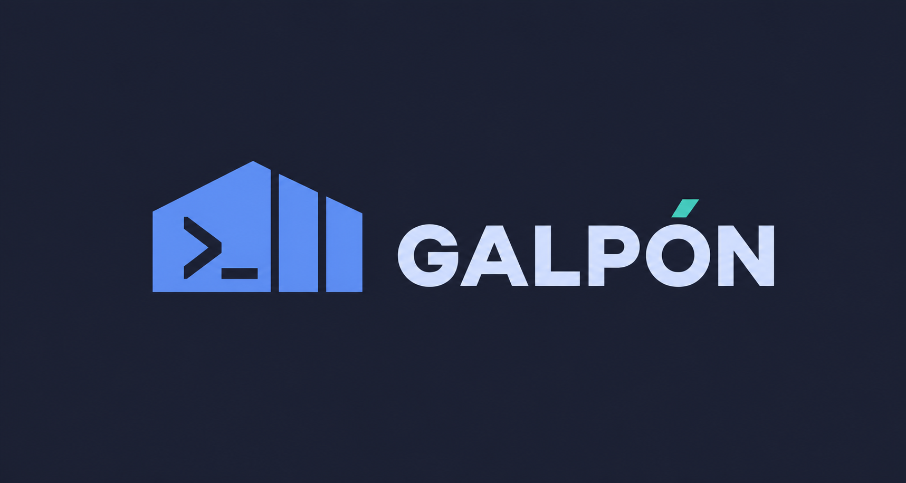
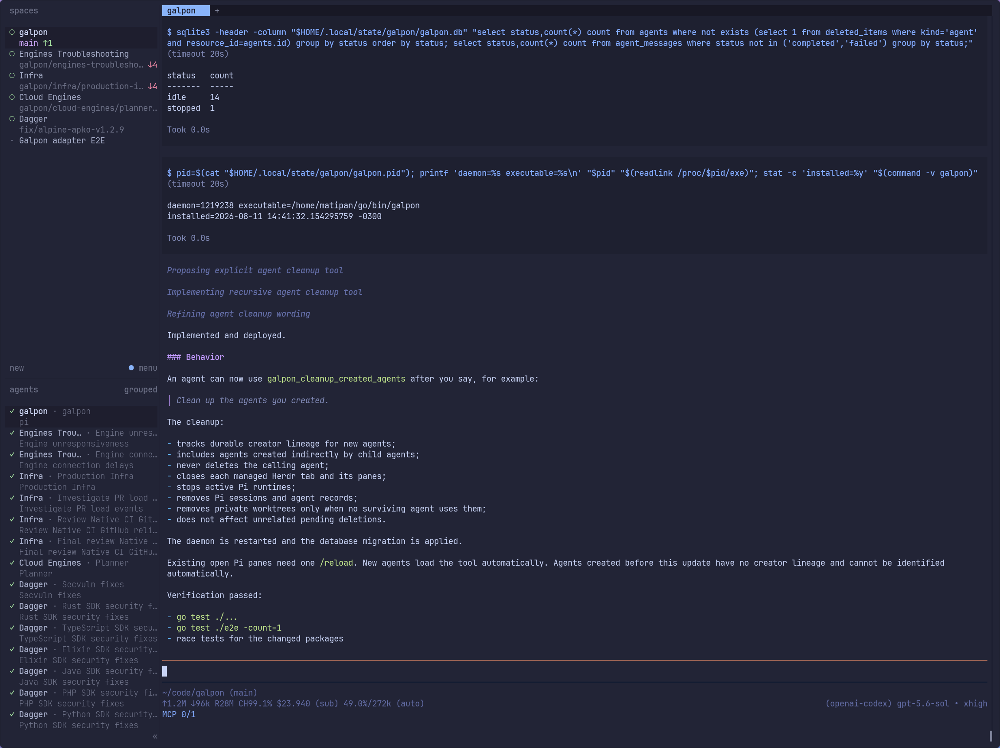
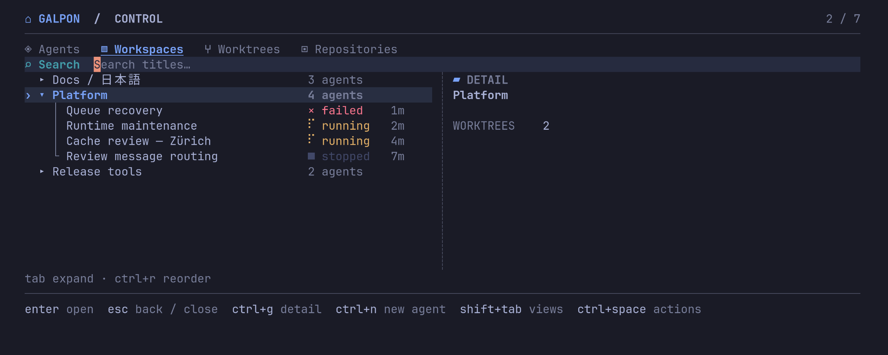

<p align="center">
  
</p>

# Galpon

**A terminal-first workstation for durable coding agents.**

Galpon manages durable workspaces and Git worktrees for you and your
[Pi](https://github.com/earendil-works/pi) coding agents. Each agent also gets
a persistent identity and session. Close a view, open the worktree or agent
again, and Galpon restores the same managed files or Pi session.

Use Galpon to:

- manage several coding agents from one command center;
- create a private Git worktree for your own terminal work;
- give each agent a private Git worktree;
- group related human and agent work in a workspace;
- fork an existing agent context without sharing its files;
- let agents send work and results to each other;
- follow and dispatch agent work from the optional phone companion;
- open your real terminal and `$EDITOR` in the correct worktree.

Galpon does not include a terminal emulator, browser terminal, file browser,
editor, or diff viewer. Its optional browser companion is a narrow agent
conversation, progress, feedback, and launch surface.

## Galpon in action

<p align="center">
  
  <br>
  <em>A durable Galpon Pi agent in its Herdr workspace.</em>
</p>

<p align="center">
  
  <br>
  <em>The command center opened with Ctrl-K over the active agent.</em>
</p>

## Quick start

### 1. Install the requirements

You need Git 2.45 or newer, Go 1.26.5 or newer, Pi, and
[Herdr](https://herdr.dev/). Galpon uses Pi for agent conversations and Herdr
to open terminal workspaces.

Install Pi:

```bash
npm install -g --ignore-scripts @earendil-works/pi-coding-agent
pi
```

In Pi, run `/login` and sign in to OpenAI Codex. This is the default provider
in Galpon. You can select a different provider later with environment
variables.

Install Herdr on macOS or Linux:

```bash
curl -fsSL https://herdr.dev/install.sh | sh
```

See the [Herdr installation guide](https://herdr.dev/docs/install/) for other
installation methods.

### 2. Install Galpon

Install Galpon from a source checkout:

```bash
git clone https://github.com/matipan/galpon.git
cd galpon
go install ./cmd/galpon
```

Make sure that `$(go env GOPATH)/bin` is in your `PATH`, then verify the
installation:

```bash
galpon --version
```

### 3. Add Galpon to Herdr

```bash
galpon herdr install
herdr
```

The install command adds a marked Galpon block to your Herdr configuration. It
does not replace your other Herdr settings. It binds <kbd>Ctrl</kbd>+<kbd>K</kbd>
to an 88% by 88% Galpon popup.

If Herdr was already running, reload its configuration:

```bash
herdr server reload-config
```

You can also run `galpon` in any terminal to open the command center directly.

### 4. Create your first agent

Open the Galpon command center with <kbd>Ctrl</kbd>+<kbd>K</kbd>, then:

1. Press <kbd>r</kbd>. Add a local Git repository path or an SSH/HTTPS Git URL.
2. Press <kbd>w</kbd>. Create a workspace for the task.
3. Select the workspace and press <kbd>a</kbd>.
4. Enter an agent name and select its repository placement.
5. Press <kbd>Ctrl</kbd>+<kbd>S</kbd> to create the agent and open Pi.

Galpon creates a private managed worktree for the agent. Work in Pi as usual.
To resume the agent, open the command center, select the agent, and press
<kbd>Enter</kbd>.

### Open a worktree without an agent

You can start with your own terminal work:

1. Select a repository and press <kbd>t</kbd>.
2. Create a new task workspace or select an existing workspace.
3. Keep the default remote and reference, or change them.
4. Press <kbd>Ctrl</kbd>+<kbd>S</kbd>.

Galpon creates a managed worktree and opens a real terminal in it. The
worktree stays durable after the terminal closes. Select the worktree later to
open it again. You can also select it and press <kbd>a</kbd> to create an agent
with a private fork or an explicit exact share.

## Command center keys

Start typing to search workspace, agent, worktree, and repository titles.

| Key | Action |
| --- | --- |
| <kbd>Enter</kbd> | Open the selected item |
| <kbd>r</kbd> | Add a repository |
| <kbd>R</kbd> | Add a named Git remote |
| <kbd>w</kbd> | Create a workspace |
| <kbd>a</kbd> | Create an agent in the selected workspace |
| <kbd>t</kbd> | Open a selected worktree, or create one from a repository |
| <kbd>e</kbd> | Open an existing worktree in `$EDITOR`, or create one from a repository |
| <kbd>x</kbd> | Hide the selected item and its dependent items |
| <kbd>q</kbd> or <kbd>Esc</kbd> | Close the command center |

The footer in each form shows the keys that are available for that form.

## Main concepts

- **Repository:** A local Git checkout or remote Git URL. Galpon imports its
  remotes and creates a shared bare mirror. It does not change or delete the
  original checkout.
- **Workspace:** A group of human and agent work for one task or project. A
  workspace can use one or more repositories.
- **Worktree:** A durable managed Git checkout in a workspace. It can exist
  without an agent and opens in your real terminal or editor.
- **Agent:** A durable Pi conversation with a file placement. An agent can use
  a managed directory, or it can have a primary worktree and secondary
  repository worktrees.
- **Placement:** The files that an agent can use. If you do not select a
  repository or another placement, Galpon creates a private managed directory.
  This is useful for coordinators that can clone repositories when needed.
  New worktree placements are private by default. You can explicitly share
  another agent's exact worktree placement.
- **Context fork:** A new Pi conversation that starts from another agent's
  context. A context fork does not change or share file placement.

Agents receive Galpon tools in Pi. These tools can create agents, delegate
work, send messages, check message state, wait for another agent, and clean up
selected agents that they created. Cross-agent requests are durable and use
at-least-once delivery with idempotent send, claim, and completion boundaries.
Each request records its parent delivery, root message, run ID, depth, and an
optional sender-title snapshot. A tool call made while an agent handles a
delivery inherits that cause. Galpon rejects work deeper than 16 orchestration
steps.

The request row stores the durable response. A separate notification state and
a transactional lifecycle-event outbox control whether the sender must wake.
The outbox addresses normal agents directly. It does not depend on a special
captain type. Galpon automatically projects a correlated result notification for
the requesting agent. A successful wait suppresses only that wake notification,
so later reads still replay the request result. A result that arrives after a
timeout starts or resumes the requesting agent as new inbound work. Outbox
projection is bounded and idempotent, so daemon recovery cannot lose a committed
result.

`galpon_await_agent` waits for one message. `galpon_await_agents` waits for 1 to
16 unique message IDs, uses one global timeout, and returns ordered outcomes when
any or all messages settle. Wait results report the wait state, durable message
state, target runtime state, delivery attempt, and a structured error kind. A
timeout returns partial state and does not cancel unfinished agent work. Galpon
rejects direct and indirect wait cycles.

Queued work expires after seven days. Processing has a total 24-hour deadline
that lease renewal cannot extend. Complete orchestration runs are retained for
30 days. If message history exceeds 10,000 rows, Galpon can remove the oldest
complete runs after a one-day minimum window; active and recent runs are never
removed by this limit. Workers return a current delivery through their final
assistant response, not by sending a second independent request. An agent that
another agent creates starts as a background delegated agent. Galpon runs its Pi
RPC process without a
Herdr tab. Ctrl-K shows delegated agents in a separate section at the bottom.
Selecting one stops its background process, resumes the same durable Pi session
in Herdr, and promotes it to the normal agent list. The browser keeps delegated
agents under their creator, where they can be inspected and messaged without a
desktop promotion. Each Pi footer shows `🛖 <workspace> · 🤖 <count>`, where the
count includes starting or running background descendants.

`galpon_create_agent` accepts an optional initial prompt. Galpon queues this
prompt before it starts Pi, so the new agent starts work as soon as its runtime
is ready. Runtime ownership fences all agent tools. Delivery leases are renewed
during long turns, expired work is retried, and repeated transport failure ends
in a visible failed result instead of an unbounded retry loop. The tool result
includes the initial message ID for later read or wait calls. Galpon records recursive creator lineage. On an explicit cleanup
request, an agent can list its agents and pass the exact relevant IDs to
`galpon_cleanup_agents`. Cleanup
closes their Herdr tabs and permanently removes their private worktrees, Pi
sessions, and related messages. A selected agent cannot be removed while one
of its descendants is not selected. A foreground agent is protected from
creator cleanup, including an agent that the user promoted from delegated work.
A coordinator or captain is a normal
agent with instructions to coordinate the other agents.

## CLI examples

The TUI supports the usual workflow. The CLI supports scripts and repeatable
setup:

```bash
galpon repo add ~/code/my-project --title "My project"
galpon workspace create "Feature work"
galpon worktree create --repo "My project" --workspace "Feature work"
galpon worktree open <worktree-id>
galpon agent create "Implementer" \
  --workspace "Feature work" \
  --repo "My project" \
  --role implementer
galpon agent create "Coordinator" \
  --workspace "Feature work" \
  --role coordinator
galpon agent send <agent-id> "Implement the approved design"
galpon agent show <agent-id>
```

Use `galpon help` to see all commands. Repository and workspace commands accept
an ID or an exact title where applicable.

## Phone companion

The phone companion is an explicit, optional localhost web service. Herdr
remains the full desktop interface and the only terminal host for Pi. The
companion can show the current Pi discussion and tool output, send text or
voice feedback to the same durable session, and start an agent in an existing
workspace from selected repositories or a private copy of an existing agent
setup. It does not provide files, diffs, an editor, a terminal,
worktree administration, cleanup, or renderer controls.

Restart the daemon and active agents after an upgrade so they load the new
conversation bridge. Then start the companion:

```bash
galpon daemon stop
galpon companion --listen 127.0.0.1:8420
```

Open <http://127.0.0.1:8420>. The companion command uses or starts the Unix
daemon, but the web process stays in the foreground. Stop it with
<kbd>Ctrl</kbd>+<kbd>C</kbd>. The normal daemon stays on its mode-`0600` Unix
socket.

Voice messages need `voxtype` and `ffmpeg` in the companion process `PATH`.
When both tools are available, the message composer shows one microphone button
and an `EN` or `ES` language toggle. The choice is stored for each agent in the
browser, and you can change it before any recording. Tap the microphone to
record. Tap it again to stop. Galpon converts the recording to a 16 kHz mono
WAV file, passes the selected language to `voxtype`, and sends the transcript
to the agent. A recording can be at most ten minutes and the upload can be at
most 12 MiB. Galpon removes its temporary audio files after transcription. A
phone browser must use HTTPS to give microphone access. A localhost browser
can use HTTP.

The message composer also accepts PNG, JPEG, GIF, and WebP images. Use the
attachment button to select files, or paste images into the message box. One
message can contain up to four images. Each image can be at most 8 MiB, and the
images can total at most 20 MiB. A text caption is optional. Galpon sends the
images to Pi as image content and shows available user, assistant, and tool
images in the discussion. The selected Pi model must support image input.

Loopback mode follows Galpon's single-user workstation boundary: a
second local OS user that can connect to loopback is not an isolated security
principal.

The default allowed browser origin is `http://127.0.0.1:8420`. For Tailscale
Serve, set the exact HTTPS origin and the one allowed Tailscale login:

```bash
galpon companion \
  --listen 127.0.0.1:8420 \
  --origin https://host.tailnet.ts.net:8443 \
  --tailscale-user owner@example.com
```

Then configure private Serve port `8443` to proxy to
`http://127.0.0.1:8420`. The listener remains fixed to `127.0.0.1`. Galpon
rejects a different Host, a different or missing Serve login, and requests
marked as Funnel. Non-loopback origins require HTTPS and `--tailscale-user`.

Do not use Funnel for the companion port. Limit that port to the exact phone in
the tailnet policy, and verify that `tailscale funnel status --json` does not
show `AllowFunnel` for it. A separate Funnel on another port can remain. This
version uses the exact Serve login as the application identity and the tailnet
policy as the device authorization layer. It does not yet add a separate phone
pairing secret.

The discussion includes prompts, assistant text, tool arguments, and the tool
output that Pi makes available to its session. Treat the companion URL as
sensitive. Thinking and reasoning blocks are not exported. Known secret-shaped
tool argument keys are redacted, but file and command output can still contain
secrets. The initial backfill contains finalized entries from the active Pi
branch; live token and tool progress starts after the agent loads the bridge.
Each mirrored event is at most 64 KiB, and each encoded public history response
is less than 4 MiB. Use **Load older discussion** to read an older page. The
browser stores one unsent draft per agent. It can install Companion as a web
application. Discussion text supports safe paragraphs, lists, code, and
absolute HTTP links without interpreting source HTML. Agent-to-agent requests
and results use a separate `🤖` delivery row that is collapsed by default. Text
sent directly from Companion remains a normal user message.

The browser-safe API is:

- `GET /api/v1/bootstrap`
- `GET /api/v1/agents/{id}?before=N&messageBefore=TOKEN` (bounded discussion pages; cursors come from the prior response)
- `GET /api/v1/events?after=N` (replayable SSE invalidations)
- `POST /api/v1/agents/{id}/messages` with `{ "prompt": "..." }`
- `POST /api/v1/agents/{id}/audio-messages` with multipart form fields `audio` and `language` (`en` or `es`)
- `POST /api/v1/agents` with either
  `{ "workspaceId": "...", "repositoryIds": ["..."], "title": "...", "role": "...", "prompt": "..." }`
  or `{ "workspaceId": "...", "sourceAgentId": "...", "title": "...", "role": "...", "prompt": "..." }`

All mutations require an exact `Origin` and an `Idempotency-Key` header. The
Unix daemon durably admits the key before it changes state. A completed retry
returns the saved result. Completed receipts are retained for 30 days; pending
receipts are retained until manual review. If the daemon stops after an effect
starts but before it saves the result, the key stays pending. A retry fails
with `409 Conflict` and requires manual review. This small crash window can
leave a partially created or queued operation, but it cannot run the same key
a second time while its receipt is retained. SSE keeps the latest 10,000
projection invalidations and sends a reset when a browser cursor is outside
that retained range.

Pi runtimes ingest normalized conversation events through the trusted Unix
route `POST /v1/runtime/agents/{id}/conversation-events`. The body contains the
active `runtimeId` and detailed events. Galpon checks the runtime registration,
deduplicates retry event IDs and finalized Pi entry IDs, and writes a durable
integer sequence for timeline and SSE replay.

## Checkpoints and operating system migration

A checkpoint moves durable Galpon state without copying managed worktree
checkouts or repository mirrors. Close all active agents first, and then run:

```bash
galpon checkpoint create ~/galpon.checkpoint
```

Galpon asks for a passphrase and writes an encrypted checkpoint file. It also
pushes one dedicated reference for each managed worktree to the repository's
configured push remote:

```text
refs/heads/galpon-checkpoints/<checkpoint-id>/<worktree-id>
```

Clean worktrees point directly to their current commit. Dirty worktrees use
internal snapshot commits. The snapshot keeps the original branch commit,
staged changes, unstaged tracked changes, and non-ignored untracked files. It
does not change the worktree branch or index. Ignored files are not uploaded,
and the command result reports their count. Checkpoint references are normal
remote Git data. Repository collaborators can read the non-ignored files in
them.

Checkpoint creation includes repositories, workspaces, agents, placements,
messages, Pi sessions, and managed agent directory files that are not marked
for cleanup. The derived companion event tables are not included. After
restore, opening an agent backfills its finalized active Pi branch into the
companion again. Checkpoint creation does not run cleanup. Agents that use
external directories are included, but files in those directories are not.
Restore reuses the recorded absolute external directory and creates it empty if
it does not exist. An external directory below the old Galpon state directory
moves to the equivalent path below the new state directory. The command result
reports the number of external directories as `unmanagedDirectories`.

Checkpoint creation fails before it writes a valid checkpoint if an agent is
active, a submodule has local changes, a worktree uses Git LFS, or a remote push
or verification fails. Local filesystem remotes are rejected by default
because they do not survive an operating system replacement. Use
`--allow-local-remotes` only when that storage will remain available.

Copy the encrypted checkpoint file to durable storage. On a new installation,
configure Git and Pi authentication and restore into an empty Galpon state
directory:

```bash
galpon checkpoint restore ~/galpon.checkpoint
```

Restore verifies every remote checkpoint commit, creates repository mirrors and
worktrees again, restores exact dirty Git state and Pi sessions, and clears old
process and Herdr view references. The remote checkpoint references remain
available so that the same checkpoint can be restored again.

For non-interactive use, set `GALPON_CHECKPOINT_PASSPHRASE` or pass
`--passphrase-file <path>` before the checkpoint file argument. Galpon cannot
recover a lost checkpoint passphrase.

## State and cleanup

Galpon starts its local daemon when needed. The daemon continues to run after
the command center closes. State is stored in `~/.local/state/galpon` by
default.

Closing an agent pane stops that Pi process, but it does not delete the agent.
The next open action starts Pi with the same Galpon agent and Pi session.
Closing a Herdr workspace also does not delete the Galpon workspace.

Run `/finish` inside a Galpon Pi agent when you are done with it. After you
confirm the action, Pi shuts down, the Herdr tab closes, and Galpon hides the
agent and its unshared private worktrees.

Pressing <kbd>x</kbd> hides durable state. It also closes each managed Herdr
agent view that the action hides, including views hidden by a cascade. It does
not immediately remove files. To permanently remove hidden records, worktrees,
sessions, and mirrors, run:

```bash
galpon cleanup
```

Cleanup never removes the original source checkout. It will ask you to stop a
hidden Pi process before it removes that agent's files. After an explicit user
request, an agent can use `galpon_cleanup_agents` with a list of exact agent
IDs. The tool never removes the calling agent or an agent outside its creator
lineage. It rejects a selected agent when an unselected descendant remains. It
closes each selected managed Herdr tab and permanently removes the selected Pi
sessions, related messages, and private worktrees that no surviving agent uses.

Stop the daemon with `galpon daemon stop`. The next `galpon` command starts it
again.

## Configuration

| Variable | Purpose | Default |
| --- | --- | --- |
| `GALPON_STATE_DIR` | State, database, socket, logs, and managed files | `~/.local/state/galpon` |
| `GALPON_PI_BIN` | Pi executable | `pi` |
| `GALPON_PI_PROVIDER` | Pi provider | `openai-codex` |
| `GALPON_PI_MODEL` | Pi model override | Provider default |
| `GALPON_HERDR_BIN` | Herdr executable | `herdr` |
| `GALPON_CHECKPOINT_PASSPHRASE` | Passphrase for non-interactive checkpoint commands | None |

Galpon uses your existing Pi provider login and Pi theme. It does not copy or
store your Pi credentials.

When Omarchy has an active theme, the Galpon command center reads its current
colors from `~/.local/state/omarchy/current/theme/colors.toml`. If that file is
missing or invalid, Galpon uses its built-in Tokyo Night Moon palette. The
terminal color profile continues to honor `NO_COLOR`.

## Development

Build from a source checkout:

```bash
go build ./cmd/galpon
```

Run the test suites:

```bash
go test ./...
go test ./e2e -count=1
node --test internal/companion/web/*.test.mjs
```

Browser tests are an explicit, separate check. Install their pinned dependency
and Chromium once, then run them against the isolated companion mock:

```bash
npm ci
npx playwright install chromium
npm run test:browser
```

The browser command starts the real Companion HTTP adapter on loopback with an
isolated temporary store and a backend that cannot reach the Galpon daemon,
Pi, Herdr, or a model. Normal Go tests and Dagger checks do not install
Playwright or start a browser.

Or run all checks in the prepared Dagger environment:

```bash
dagger --x-release v1.0.0-beta.9 check
```

The Dagger test environment includes the pinned Go, Node, Pi, and Herdr versions
that the end-to-end suite needs. The suite uses the real Pi and Herdr binaries
with a local mock model endpoint. It does not call a paid model.

## Terminal frontends

Herdr is a terminal frontend for Galpon, and tmux can be another frontend.
These frontends only present Galpon workspaces, agents, and terminals. Galpon
currently implements the Herdr frontend only. It does not implement a tmux
frontend yet.
